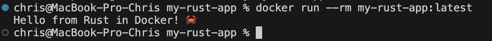

# my-rust-app — CI/CD Pipeline на Rust


Учебный проект, демонстрирующий настройку **CI/CD** для приложения на **Rust** с использованием **GitHub Actions** и контейнеризацией через **Docker**.

## Содержание

- [Описание проекта](#описание-проекта)
- [Чему вы научитесь](#чему-вы-научитесь)
- [Структура проекта](#структура-проекта)
- [Пайплайн CI/CD](#пайплайн-cicd)
- [Быстрый старт](#быстрый-старт)
- [Локальная разработка](#локальная-разработка)
- [Работа с Docker-образом](#работа-с-docker-образом)
- [Проверка в GitHub Actions](#проверка-в-github-actions)
- [Лицензия](#лицензия)

## Описание проекта

Простой проект, который можно склонировать, настроить и убедиться, что приложение на **Rust** успешно собирается, тестируется и запускается в контейнере через пайплайн **GitHub Actions**.

**Rust** — это современный язык программирования общего назначения, ориентированный на безопасность, скорость и параллелизм.

## Чему вы научитесь

- Настраивать **CI** для Rust-проектов (линтинг, форматирование, тесты, сборка)
- Контейнеризировать приложения с помощью **Docker** (multistage-сборка)
- Кэшировать слои сборки для ускорения пайплайна
- Сохранять артефакты (Docker-образ) для локального использования

## Структура проекта

```
my-rust-app/
├── .github/
│   └── workflows/
│       └── rust-ci.yml     # Конфигурация пайплайна CI
├── src/
│   └── main.rs              # Точка входа приложения
├── Cargo.toml
├── Cargo.lock
├── Dockerfile                # Multistage-сборка образа
├── .dockerignore
├── .gitignore
└── README.md
```

Создать структуру одной командой:

```bash
mkdir -p .github/workflows src && \
touch .github/workflows/rust-ci.yml \
      Cargo.toml Cargo.lock .dockerignore .gitignore src/main.rs \
      Dockerfile README.md
```

## Пайплайн CI/CD

Workflow (`.github/workflows/rust-ci.yml`) состоит из трёх последовательных джобов:

| № | Job | Что делает |
|---|-----|-----------|
| 1 | **Lint & Format** | Проверка форматирования (`cargo fmt --check`) и линтинг (`cargo clippy -D warnings`) |
| 2 | **Build & Test** | Быстрая проверка типов (`cargo check`), debug- и release-сборка, запуск тестов (`cargo test`) |
| 3 | **Build Docker Image** | Сборка Docker-образа через Buildx с кэшированием, сохранение образа как артефакта, тестовый запуск контейнера |

Пайплайн запускается автоматически на `push` и `pull_request` в ветки `main`/`master`, а также вручную через `workflow_dispatch`. Каждый job зависит от успешного завершения предыдущего (`needs`), поэтому Docker-образ собирается только если код прошёл линтинг и тесты.

## Быстрый старт

1. Создайте на GitHub новый публичный репозиторий `my-rust-app` с `README.md`.
2. Склонируйте его и создайте структуру проекта (см. выше).
3. Заполните `rust-ci.yml`, `Cargo.toml`, `src/main.rs`, `Dockerfile`, `.dockerignore`, `.gitignore` по образцу из инструкции.
4. Закоммитьте и запушьте изменения в `main`.

## Локальная разработка

Проверка типов без полной сборки:

```bash
cargo check
```

Форматирование кода:

```bash
cargo fmt --all
```

Линтинг:

```bash
cargo clippy -- -D warnings
```

Запуск тестов:

```bash
cargo test
```

Сборка release-версии:

```bash
cargo build --release
```

## Работа с Docker-образом

Собрать образ:

```bash
docker build -t my-rust-app:latest .
```

Проверить, что образ создался:

```bash
docker images | grep my-rust-app
```

Запустить контейнер:

```bash
docker run --rm my-rust-app:latest
```

Войти в контейнер в интерактивном режиме:

```bash
docker run -it --rm --entrypoint /bin/bash my-rust-app:latest
```

Выйти из контейнера:

```bash
exit
```

## Проверка в GitHub Actions

Перейдите во вкладку **Actions** вашего репозитория на GitHub — вы увидите, как запускается Workflow. Через несколько минут появится зелёная галочка, означающая, что все шаги (линтинг, тесты, сборка Docker-образа) прошли успешно. Если Workflow завершился с ошибкой — красным — исправьте ошибки и запушьте изменения снова.
#


## Лицензия

Проект распространяется под лицензией MIT — см. файл [LICENSE](LICENSE).